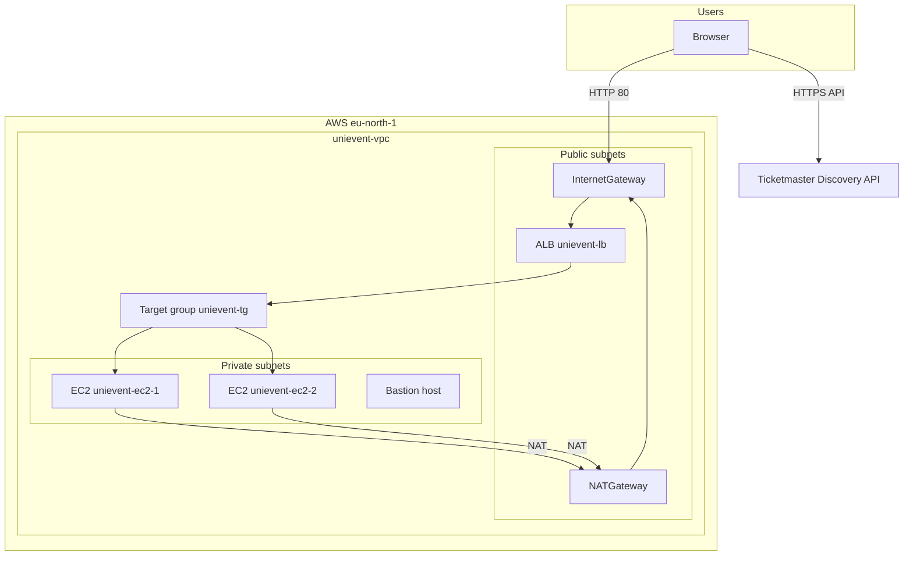
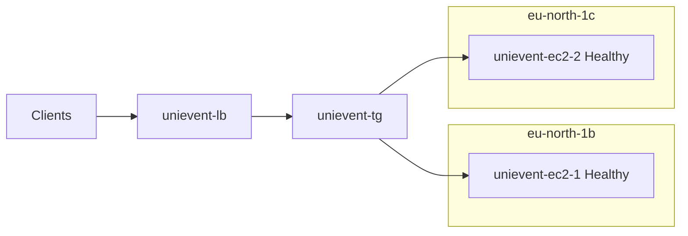
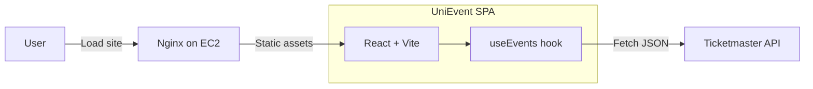

# UniEvent — Scalable AWS Deployment

**Course:** CE 308/408 · Cloud Computing  
**Institution:** Ghulam Ishaq Khan Institute of Engineering Sciences and Technology  

**Student:** Mian Arqam  
**Registration No.:** 2022294  

---

UniEvent is a cloud-hosted **University Event Management** front end: students browse events, explore a gallery-style experience, and see event details. Event listings are populated from the **Ticketmaster Discovery API** (a public, JSON-based events API), satisfying the assignment requirement to integrate an external Open API rather than manual data entry.

This repository documents the **AWS architecture**, the **React (Vite)** application under [`unievent/`](unievent/), and **console evidence** for a highly available deployment in **Europe (Stockholm) `eu-north-1`**.

---

## Live demo

**Application Load Balancer (HTTP):**  
[http://unievent-lb-446856715.eu-north-1.elb.amazonaws.com/](http://unievent-lb-446856715.eu-north-1.elb.amazonaws.com/)

The endpoint uses **HTTP on port 80** (browser may show “Not secure”). For production, you would attach an **ACM certificate** on the ALB and redirect HTTP → HTTPS.

---

## What was built (short)

| Layer | Choice |
|--------|--------|
| **Network** | Custom **VPC** (`unievent-vpc`) with **3 public** and **2 private** subnets across AZs |
| **Edge / traffic** | **Internet-facing Application Load Balancer** `unievent-lb` in public subnets |
| **Compute** | **Two** Ubuntu **EC2** instances (`unievent-ec2-1`, `unievent-ec2-2`) serving the static build behind **Nginx**; **bastion host** for SSH administration |
| **Resilience** | **Target group** `unievent-tg` with **healthy targets in two AZs**; ALB health checks |
| **Outbound from private subnet** | **NAT Gateway** (see VPC / route tables) for patches, `apt`, and runtime calls |
| **App data** | Browser calls **Ticketmaster API** using a **build-time** API key (see [`unievent/.env.example`](unievent/.env.example)) |

---

## Architecture diagrams

### 1. Network and traffic flow

Users reach the SPA through the **ALB** only. Application servers sit in **private** subnets; outbound internet (OS updates, optional backend flows) uses a **NAT Gateway** in a public subnet.



**Note:** In the current UniEvent implementation, the **Ticketmaster request is made from the user’s browser**, not from EC2. The NAT path is still part of the **VPC design** (OS updates, package installs, and any future server-side integration).

---

### 2. Fault tolerance (multi-AZ)

Two application instances in **different Availability Zones** register with the same target group. If one instance or AZ is impaired, the ALB can route traffic to the remaining healthy target (subject to health check configuration).



---

### 3. Application logic (frontend)



---

## AWS services (assignment mapping)

### VPC

- **VPC:** `unievent-vpc` (`vpc-0d547270dc71396f8`), region **`eu-north-1`**.  
- **Subnets:** Three **public** and two **private** subnets for separation of concerns: public tier for **ALB / NAT / bastion**, private tier for **application servers**.  
- **Routing:** Dedicated **public route table** (`public-rt`) associated with the public subnets (evidence below). Private subnets use routes that send `0.0.0.0/0` to the **NAT Gateway** so instances without public IPs can reach the internet safely.

### Elastic Load Balancing

- **Application Load Balancer** `unievent-lb`: **internet-facing**, **HTTP**, spans **multiple AZs**, DNS  
  `unievent-lb-446856715.eu-north-1.elb.amazonaws.com`.  
- **Target group** `unievent-tg`: **Instance** targets, **port 80**, health checks to the web servers.

### EC2

- **unievent-ec2-1** / **unievent-ec2-2:** `t3.micro`, **Nginx** serves the production build from `/var/www/unievent/build` (see [`unievent/DEPLOY.md`](unievent/DEPLOY.md)).  
- **bastion-host:** optional **jump box** in a public subnet for **SSH** into private instances (security groups should restrict **22/tcp** to your IP).

### IAM (design and practice)

- **Human access:** AWS console tasks (VPC, EC2, ELB) performed under a signed-in **IAM user** with permissions scoped for the lab (avoid using the **root** account for daily work).  
- **EC2 instance roles (recommended pattern):** For assignments that require **S3** for media, attach an **IAM instance profile** to EC2 with a policy granting only required actions (e.g. `s3:PutObject`, `s3:GetObject` on one bucket prefix). This avoids long-lived access keys on disk.  
- **Bastion:** SSH key pair stored **locally** (`.pem` **never** committed to git); see security section.

### S3 (architectural role vs. current SPA)

The brief asks for **secure storage of posters / media in S3**. Architecturally:

- **Bucket:** private (**Block Public Access** on), **SSE-S3** (or **SSE-KMS**) encryption, versioning optional.  
- **Access:** applications should use **IAM roles** (instance profile) or **presigned URLs** — not public bucket ACLs.  
- **Current UniEvent build:** the **gallery and event imagery** shown in the UI are driven primarily from **Ticketmaster’s image URLs** returned by the API (fast to demo).  
- **Extension for full “upload to S3” behavior:** add a small **upload API** (Lambda + API Gateway, or a minimal Node service on EC2) that writes objects to S3 and returns a **presigned GET** for display — with **least-privilege IAM** on that path.

This README states both what is **deployed in AWS** (VPC, ALB, multi-AZ EC2) and how **S3/IAM** fit the **target end state** for production-grade media handling.

---

## Repository layout

```
Assignment1_AWS_CE/
├── README.md                 ← This file (architecture + evidence)
├── docs/
│   └── screenshots/          ← AWS console and browser evidence
├── unievent/                 ← React (Vite) source, nginx.conf, DEPLOY.md
└── .gitignore
```

---

## Local development (UniEvent)

```bash
cd unievent
cp .env.example .env
# Add your Ticketmaster API key as VITE_TICKETMASTER_KEY or REACT_APP_TICKETMASTER_KEY
npm ci
npm run dev
```

Build for production:

```bash
npm run build
```

Deploy steps for EC2 + Nginx are in [`unievent/DEPLOY.md`](unievent/DEPLOY.md).

---

## Security notes

- **Security groups:** ALB allows **80/tcp** from the internet; EC2 application tier allows **80/tcp** from the **ALB security group** (not from `0.0.0.0/0`). **SSH** should be restricted (often **bastion** only, source IP limited).  
- **Secrets:** API keys live in **`.env`** locally and on the server for builds — **never** commit `.env` or `*.pem`.  
- **Headers:** Nginx config adds security headers (`X-Frame-Options`, CSP, etc.) — see [`unievent/nginx.conf`](unievent/nginx.conf).

---

## Cost / operations (brief)

- **NAT Gateway** and **Application Load Balancer** are billed continuously; **two EC2** instances increase availability but also cost versus a single node.  
- **Multi-AZ** reduces the risk of a single-AZ outage taking down the whole service.

---

## Evidence (screenshots)

### VPC subnets — `unievent-vpc` (public + private)


*Custom VPC with multiple public and private subnets for tiered placement of ALB, NAT, bastion, and application servers.*

### Route tables — public routing


*Public route table associated with public subnets; part of the path from the internet to the ALB.*

### Application Load Balancer — `unievent-lb`


*Internet-facing ALB in `eu-north-1` with DNS name matching the live demo URL.*

### Target group — `unievent-tg` (healthy targets)


*Two registered instances, both **healthy**, distributed across availability zones.*

### EC2 — bastion + UniEvent application servers


*`unievent-ec2-1` and `unievent-ec2-2` in separate AZs; bastion for SSH access.*

### SSH session — Ubuntu on private-range address


*Administrative access pattern consistent with private-subnet application hosts.*

### UniEvent running on the ALB DNS name


*SPA loaded from the ALB DNS URL shown in the Live demo section.*

### Additional console evidence

| File | Description |
|------|-------------|
| [`08-aws-console-evidence-1.png`](docs/screenshots/08-aws-console-evidence-1.png) | Supplementary AWS console capture |
| [`09-aws-console-evidence-2.png`](docs/screenshots/09-aws-console-evidence-2.png) | Supplementary AWS console capture |
| [`10-aws-console-evidence-3.png`](docs/screenshots/10-aws-console-evidence-3.png) | Supplementary AWS console capture |
| [`11-aws-console-evidence-4.png`](docs/screenshots/11-aws-console-evidence-4.png) | Supplementary AWS console capture |
| [`12-aws-console-evidence-5.png`](docs/screenshots/12-aws-console-evidence-5.png) | Supplementary AWS console capture |
| [`13-unievent-browser-alt-view.png`](docs/screenshots/13-unievent-browser-alt-view.png) | Alternate browser view of UniEvent |

---

## References

- [UniEvent deployment guide](unievent/DEPLOY.md)  
- [Ticketmaster Discovery API](https://developer.ticketmaster.com/products-and-docs/apis/discovery-api/v2/) (external; API key required)

---

*Submitted as **Assignment 1 — Deployment of UniEvent on AWS** (CE 308/408).*
=======
# React + Vite

This template provides a minimal setup to get React working in Vite with HMR and some ESLint rules.

Currently, two official plugins are available:

- [@vitejs/plugin-react](https://github.com/vitejs/vite-plugin-react/blob/main/packages/plugin-react/README.md) uses [Babel](https://babeljs.io/) for Fast Refresh
- [@vitejs/plugin-react-swc](https://github.com/vitejs/vite-plugin-react-swc) uses [SWC](https://swc.rs/) for Fast Refresh
>>>>>>> origin/main
